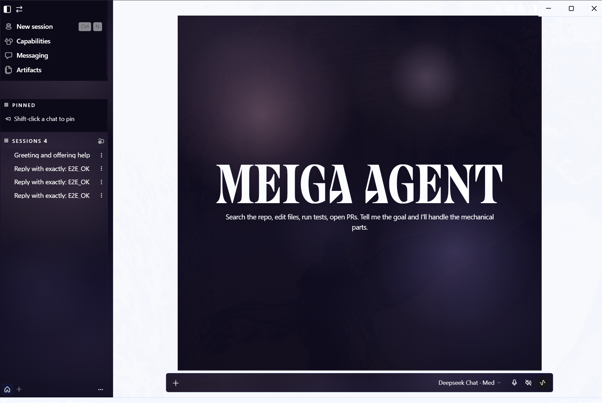

<p align="center">
  
</p>

# Meiga Agent ☤

<p align="center">
  <b>A beautifully customized AI agent, reborn from Hermes Agent.</b><br>
  Dark floral theme · DeepSeek-powered · Windows desktop ready
</p>

---

## ✨ What makes Meiga special

| Feature | Detail |
|---------|--------|
| 🌸 **Elegant dark theme** | Rich purple backgrounds with floating decorative orbs |
| 💎 **Custom neon icon** | Hand-crafted "H" wordmark in electric blue and violet |
| 🤖 **DeepSeek V4** | Powered by `deepseek-chat` via the OpenAI-compatible API |
| 🖥️ **Desktop app** | Full Electron desktop experience with pink chat history |
| 🧠 **Self-improving agent** | Skills, memory, scheduled jobs, and cross-session learning |
| 🔧 **40+ tools** | Terminal, browser, file operations, code execution, and more |

---

## Quick Start (Windows)

### Prerequisites

- **Python 3.11** (via `uv python install 3.11`)
- **Node.js** ≥ 20 (v24.x recommended)
- **uv** package manager
- **Git Bash** or PowerShell

### CLI Mode

```powershell
.\run.ps1              # Start interactive terminal
.\run.ps1 doctor       # Health check
.\run.ps1 -z "Hello"   # One-shot query
```

### Desktop App

```cmd
cd /d D:\tmp\RuyiHermesAgent\apps\desktop
set HERMES_DESKTOP_HERMES_ROOT=D:\tmp\RuyiHermesAgent
set HERMES_HOME=D:\tmp\RuyiHermesAgent\workspace
node_modules\electron\dist\electron.exe .
```

### Configuration

Set your API key in `workspace\.env`:

```env
OPENAI_API_KEY=sk-your-deepseek-key
DEEPSEEK_API_KEY=sk-your-deepseek-key
OPENAI_BASE_URL=https://api.deepseek.com
```

---

## 🎨 Customization

| Element | Style |
|---------|-------|
| Background | Dark floral with floating pink + lavender orbs |
| Chat text | Soft pink `#f0a0c0` |
| UI text | White |
| Cards/overlays | Rich dark purple |
| Wordmark | **MEIGA AGENT** in Collapse font |
| Window icon | Custom neon "H" (6 sizes, ICO/PNG/ICNS) |
| Scrollbar | Thin lavender gradient |

---

## 🏗️ Build

```bash
# Install workspace dependencies
cd D:\tmp\RuyiHermesAgent
npm install

# Build desktop app
cd apps\desktop
npm run build
```

---

## 📦 Tech Stack

| Layer | Technology |
|-------|-----------|
| **Desktop shell** | Electron 40 + React 19 + Vite 8 |
| **Agent core** | Python (AIAgent + model_tools + toolsets) |
| **Gateway** | FastAPI + WebSocket JSON-RPC |
| **Package manager** | uv (Python), npm workspaces (JS) |
| **Model** | DeepSeek V4 Flash (via `api.deepseek.com`) |

---

## 🤝 Credits

Built on the incredible [Hermes Agent](https://github.com/NousResearch/hermes-agent) by [Nous Research](https://nousresearch.com).

Meiga customization by [@grchylay](https://github.com/grchylay).

---

## 📄 License

MIT — see [LICENSE](LICENSE).
